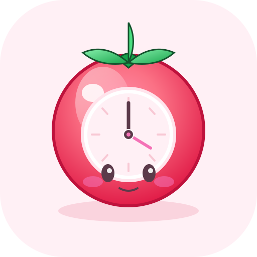

# Sheenidoro 🍅 — Pastel Sakura Pomodoro for Omarchy

React + Electron pomodoro with native Hyprland window, mako notifications, tray hide-on-close, and break history review. Pastel sakura pink (`#fff0f5` / `#f472b6`).



> Project lives at `/home/tartarus/Projects/pomodoro` but app is branded **Sheenidoro** everywhere (window title, .desktop, tray, waybar).

---

## Features

- **Editable durations**: Focus / Short Break / Long Break (1–90 min, long every 2–10 focuses). Changes apply next cycle. Presets 15/25/50.
- **Always wait for user**: No auto-start — after each phase, waits for **Start** click.
- **Chime only**: Soft `assets/sounds/chime.wav` on transition, no ticking.
- **Stay running**: Close → hide to tray, timer continues. Tray: Show, Toggle, Skip, Quit.
- **Break review**: History view lists every session (`completed`/`skipped`/`interrupted`), stats (today focus/break, weekly total, completion %), weekly Recharts bar, filters (Today/Week/All), CSV export.
- **Notifications**: Electron `Notification` + `notify-send -a Sheenidoro -u critical` (visible even in mako DND, your `~/.config/mako/config` whitelists `notify-send`).
- **Pastel sakura theme**: Tailwind extended palette, `JetBrainsMono Nerd Font`, circular gradient progress.
- **Waybar mini-timer**: Writes `~/.local/state/sheenidoro/waybar.json` every 250ms while running.
- **Native Hyprland**: `frame:true`, respects Omarchy `decoration`/`general` looknfeel.

Graphics: generated kawaii tomato SVGs — app icon 512, tray 22, focus/short/long/empty illustrations.

## Quick Start (Dev)

```bash
cd /home/tartarus/Projects/pomodoro
npm install
npm run dev        # vite on http://localhost:5173
# in another terminal, after vite is up:
npm run build:electron   # tsc electron + vite build
npx electron .           # or: npm run dev:electron
```

Or one-shot:

```bash
npm install
npm run build            # vite build -> dist/
npx tsc -p tsconfig.electron.json  # -> dist-electron/
electron .               # loads dist/index.html
```

Test notification:

```bash
notify-send -a Sheenidoro -u critical -i resources/icon.png "Focus complete! 🍅" "Take a 5 min break"
paplay assets/sounds/chime.wav
```

## Build / Package

```bash
npm run build            # typecheck + vite
npx tsc -p tsconfig.electron.json
npm run dist             # electron-builder -> release/ (AppImage + pacman)
makepkg -s               # uses PKGBUILD -> sheenidoro-1.0.0-1-x86_64.pkg.tar.zst
sudo pacman -U sheenidoro-*.pkg.tar.zst
sheenidoro               # launches via /usr/bin/sheenidoro wrapper (electron37)
```

Wrapper in `PKGBUILD` uses system `/usr/bin/electron37` (already on your Omarchy). App installed to `/opt/sheenidoro`, icons to `hicolor`, desktop to `/usr/share/applications/sheenidoro.desktop`.

## Omarchy Integration

### Waybar

Add to `~/.config/waybar/config.jsonc`:

```json
"custom/sheenidoro": {
  "exec": "cat ~/.local/state/sheenidoro/waybar.json",
  "return-type": "json",
  "interval": 1,
  "on-click": "sheenidoro --toggle",
  "on-click-right": "sheenidoro --show",
  "tooltip": true
},
```

And include `"custom/sheenidoro"` in `modules-center` or `modules-right`.

Helper script alternative:

```json
"exec": "~/.local/share/sheenidoro/waybar-sheenidoro.sh"
```

Style in `~/.config/waybar/style.css`:

```css
#custom-sheenidoro { padding: 0 8px; font-family: 'JetBrainsMono Nerd Font'; }
#custom-sheenidoro.focus { color: #ec4899; }
#custom-sheenidoro.break { color: #fb7185; }
#custom-sheenidoro.paused { opacity: 0.7; }
```

Waybar file example:

```json
{ "text": "23:41 🍅", "tooltip": "Focus ● running — 23:41 left • 2 focus done", "class": "focus", "percentage": 62 }
```

### Hyprland (optional float)

In `~/.config/hypr/looknfeel.conf` or `~/.config/hypr/hyprland.conf`:

```
windowrule = float, match:class Sheenidoro
windowrule = size 1000 680, match:class Sheenidoro
windowrule = center, match:class Sheenidoro
```

Native header already, so Hyprland borders/shadows apply.

### Mako

Already themed pink at `~/.config/mako/config`:

```
background-color=#fff0f5
border-color=#f8c8d4
text-color=#5c3a4a
```

Sheenidoro uses `-u critical` so notifications bypass DND (your config has `[mode=do-not-disturb] invisible=true` but whitelists `notify-send`).

## CLI

```bash
sheenidoro              # open / focus window
sheenidoro --toggle     # toggle start/pause via IPC to running instance
sheenidoro --show       # bring to front
sheenidoro --waybar     # print waybar json and exit (for debugging)
```

Single-instance lock: second launch focuses existing window.

## Data & Config

- **Settings & sessions**: `~/.config/sheenidoro/config.json` (electron-store)
  ```json
  { "settings": { "focusMin":25, "shortBreakMin":5, "longBreakMin":15, "longBreakEvery":4, "soundEnabled":true, "notifyEnabled":true },
    "sessions": [ { "id":"abc", "mode":"focus", "plannedSec":1500, "actualSec":1500, "startedAt":"...", "endedAt":"...", "status":"completed" } ] }
  ```
- **Waybar state**: `~/.local/state/sheenidoro/waybar.json` (generated 4×/sec)
- **Chime**: `assets/sounds/chime.wav` → bundled to `dist/assets/` and `public/sounds/`
- **Bounds**: `windowBounds` in store, restored on launch.

Export CSV: History → Export or `~/.local/share/sheenidoro/waybar-sheenidoro.sh` logic keeps `~/Documents/sheenidoro-history.csv`.

## Project Structure

```
.
├── docs/spec.md                 # full spec sheet
├── electron/main.ts             # BrowserWindow, tray, IPC, notify, waybar file
├── electron/preload.ts          # contextBridge
├── src/
│   ├── App.tsx                  # view router + shortcuts (Space/R/S)
│   ├── main.tsx, index.css      # tailwind sakura
│   ├── lib/types.ts, usePomodoro.ts, format.ts
│   ├── components/TimerRing.tsx, Sidebar.tsx
│   ├── views/TimerView.tsx, HistoryView.tsx, SettingsView.tsx
│   └── assets/illustrations/*.tsx  # generated SVGs
├── assets/sounds/chime.wav
├── resources/icon.png (512) + -256/-128/-64/-32 + tray.png + sheenidoro.desktop
├── scripts/waybar-sheenidoro.sh
├── PKGBUILD
├── tailwind.config.js, vite.config.ts, tsconfig*.json
└── CHANGELOG.md
```

## Shortcuts

- **Space**: Start / Pause / Resume
- **R**: Reset current phase
- **S**: Skip to next mode (marks `skipped`)

Close button = hide to tray (not quit) — use tray Quit or `Ctrl+Q`.

## Troubleshooting

- **No window on Hyprland**: `hyprctl clients | grep Sheenidoro` → if hidden, `sheenidoro --show` or click tray.
- **No notification**: check `mako` running (`systemctl --user status mako`), test `notify-send -a Sheenidoro -u critical test`.
- **No waybar**: ensure `~/.local/state/sheenidoro/waybar.json` exists (`cat` it), then `killall -SIGUSR2 waybar`.
- **Electron not found**: wrapper tries `electron37` → `electron` fallback; install `electron37` via pacman.

## License

MIT — see `LICENSE` if added. Graphics generated for this project.

---

Built for Omarchy — pink, calm, focused. 🌸
